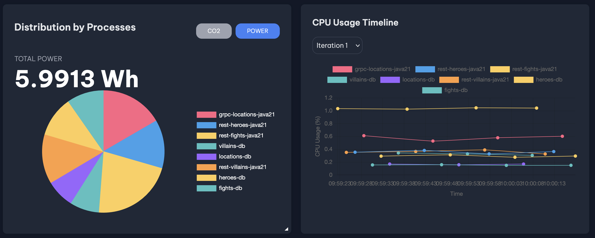
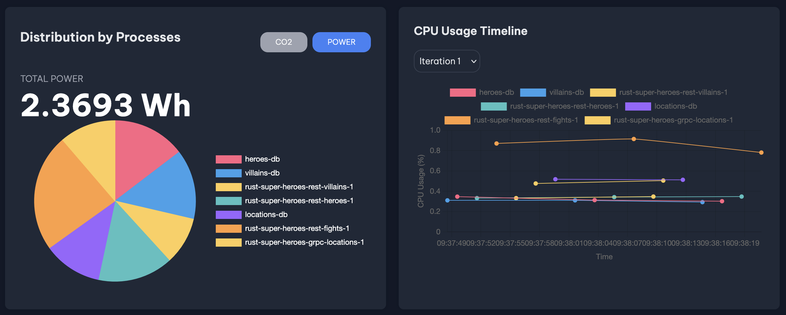

## Introduction

Rough rewrite of the superheroes Quarkus demo, in order to compare energy usage.

The Quarkus demo is a bit of a showcase of different technologies, so it has a huge diversity in tech, I've tried to keep it functionally the same in Rust.

I tried to write decently performing code but didn't do any optimizing.

Error handling is largely just unwrapping

### TO-DO's:
Save the fights to MongoDB
Save the stats to Kafka

The databases are the same containers as the original (2x Postgres 1x MariaDB, 1x MongoDB)

Quarkus:

Rust:
